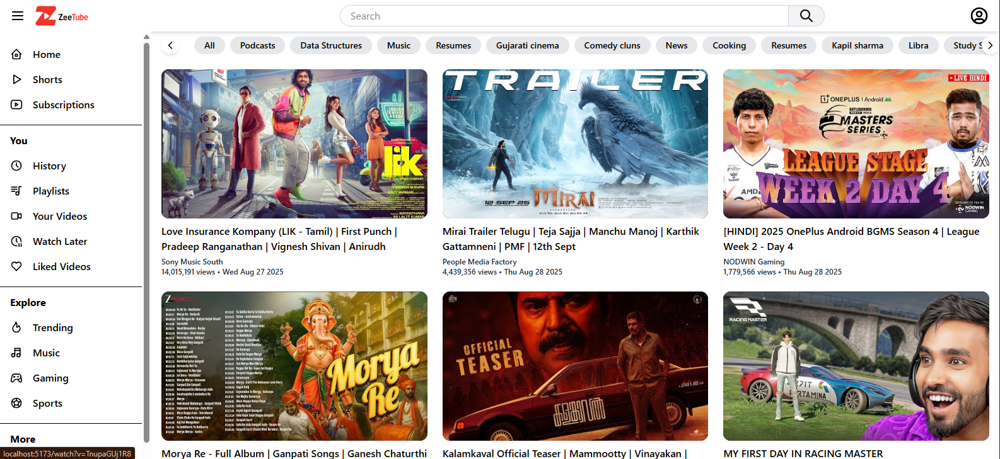
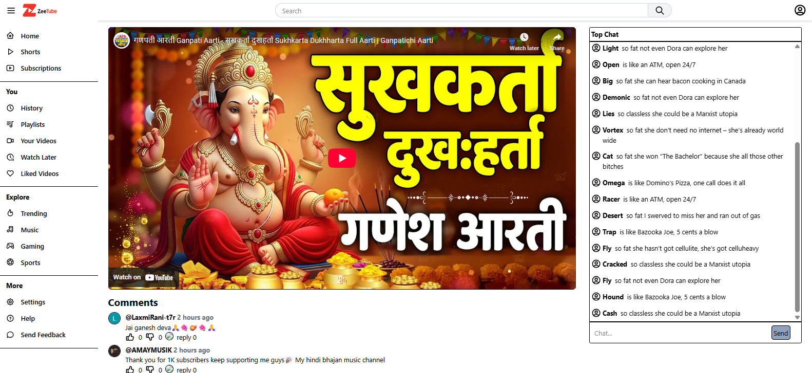
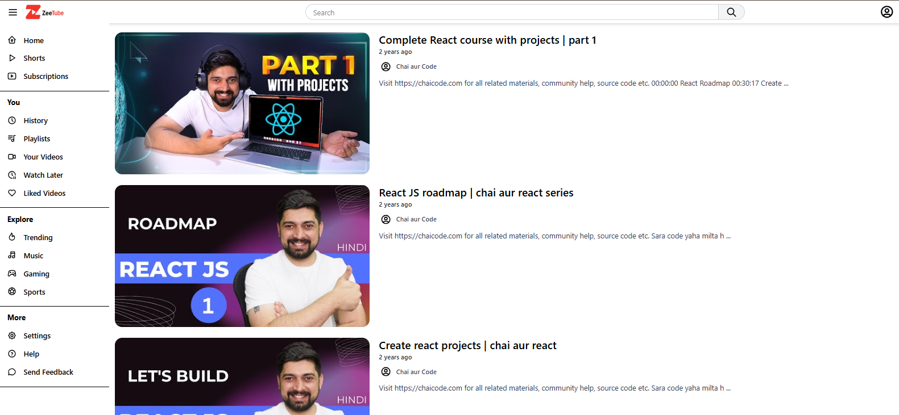

# ZeeTube

A **YouTube Clone** built with React, TailwindCSS, and modern web tools. 

ZeeTube allows you to explore videos, view details, check comments, and even enjoy a simulated live chat experience — all wrapped in a responsive UI.

## ✨ Features
- 📺 Home Feed – Display trending/related videos with a sidebar navigation.  
- 🔎 Search with Debouncing – Optimized search results with reduced API calls.  
- 🎬 Video Page – Click any video to view it in detail along with:
  - Video title, channel info, views, and publish date.  
  - Comments Section (fetched from YouTube API).  
  - Live Chat Simulation – Messages are generated randomly to mimic real-time chat.  
- 💬 Comments – Threaded comments like YouTube.  
- 📱 Responsive Design – Works on desktop, tablet, and mobile.  
- ⚡ Skeleton Loaders – Smooth loading UI with animated placeholders.  

## 🛠️ Tech Stack
- **Frontend:** Html, Css ,Javascript , React, React Router, TailwindCSS  
- **State Management:** React Hooks (useState, useEffect), Redux-Toolkit
- **API:** YouTube Data API v3  
- **Utilities:** Moment.js (for dates), Random generator (for live chat)

## 🚀 Getting Started

### 1️⃣ Clone the repo

git clone https://github.com/your-username/zeetube.git
cd zeetube

2️⃣ Install dependencies
npm install

3️⃣ Add your YouTube API Key
VITE_YOUTUBE_API_KEY=your_api_key_here

4️⃣ Run the dev server
npm run dev

## 📂 Project Structure

```
ZeeTube/
├── src/
│   ├── components/     # Reusable UI components (VideoCard, Comment, Sidebar, etc.)
│   ├── pages/          # Page-level components (Home, Watch, SearchResults)
│   ├── utils/          # Helper functions (API calls, debouncing, random generator)
│   └── App.jsx         # Main app entry
```


# 🔮 Future Enhancements

Real-time live chat with WebSockets
User authentication (Google OAuth)
Playlists and subscriptions
Dark mode support

# 📸 Screenshots

1. Home Page with Sidebar


2. Video Page with Comments & Live Chat


3. Search Results


# 🙌 Acknowledgements

YouTube Data API v3
React
TailwindCSS

# 🧑‍💻 Author

ZeeTube is built with ❤️ by Ruchi Agrawal.

Feel free to fork, contribute, or give this project a ⭐ on GitHub!